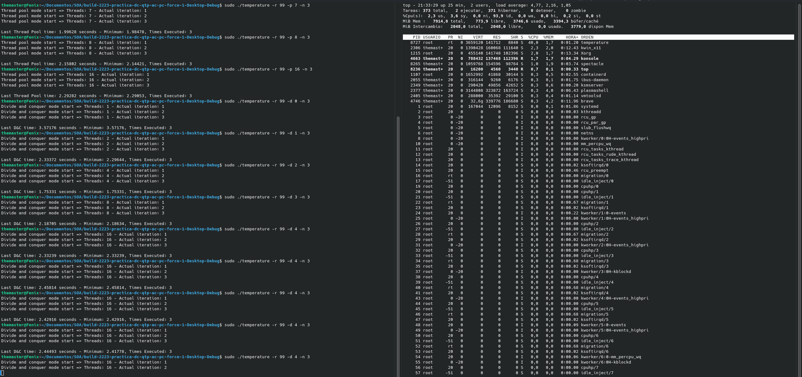
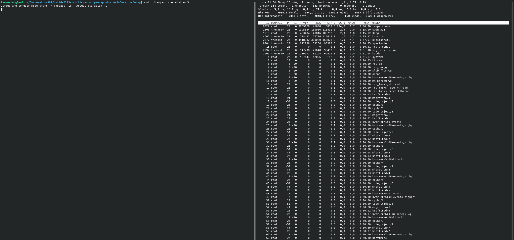

<h1 align="center"><project-name></h1>

<project-description

## Title
D&C_Thread_Pool_Temperature. Output program is called "temperature".

## Description

This program does calculations of median and average in a set of random temperature measurements in a whole year. Two versions with optional real-time priority: ThreadPool and Divide & Conquer.

## Links

- [Repo](https://github.com/ull-esit-sistemas-operativos/2223-practica-dc-qtp-ac-pc-force-1.git "GitHub Repository")
- [Results spreadsheet](https://docs.google.com/spreadsheets/d/17xTmnpidKbTFIWEbRDqfGnBObK4pq8KJEpfwty7eSSQ/edit?skip_itp2_check=true#gid=0 "Google Drive SpreadSheet containing the results and graphical comparisons")

## Screenshots

## Process for calculating performance

Program may be initiated with any of the commands below, and as such, a certain mode may be run several times
with real-time priority activated if required. After the process finishes, the last time value and the best (minimum)
one are indicated. The results and graphical comparisons may be seen in the Google Drive SpreadSheet above. 3 executions
were done for each mode and its derivations depending on threads, in order to get the best result out of 3 and not
consume too much time.

## Available Commands

Invoking modes are as follows (in any order):
-    --help / -h # Shows these instructions
-    --pool-of-threads / -p VALUE # Runs program in ThreadPool mode with VALUE indicating number of threads
-    --divide-and-conquer / -d VALUE # Runs program in D&C mode with VALUE indicating number of divisions
-    --number-of-exec / -n TIMES # Executes the last indicated method (-p/-d) the number of times written
-    --real-time-priority / -r PRIORITY # Gives real-time priority based on range 1-99 (the greater the value, the better)

Notes: 
-    '#' indicates a comment. 
-    Using -p and -d together is allowed; last one will be considered
-    Real-time priority is determined as -1 - value, so priority ends up being [-1,-100]
-    Standard scheduler is usually quite good, therefore important real-time priority benefits are not usually observed
-    Root privileges required for real-time executions

## Built With

- C++
- QT Creator

## Authors

**Ángel Javier Díaz Balboa**

- [Profile](https://github.com/javierD7)
- [Email](mailto:alu0101432632@ull.edu.es?subject=Hi_there "Hi there!")

**Cheuk Ng Pante**

- [Profile](https://github.com/feichay10)
- [Email](mailto:alu0101364544@ull.edu.es@ull.edu.es?subject=Hi_there "Hi there!")

**Cristopher Manuel Afonso Mora**

- [Profile](https://github.com/CristopherAfonso)
- [Email](mailto:alu0101402031@ull.edu.es@ull.edu.es?subject=Hi_there "Hi there!")
